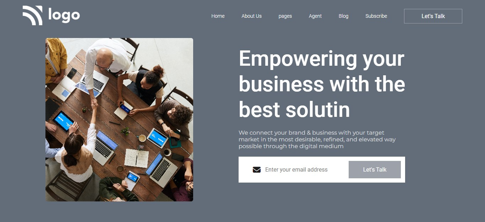
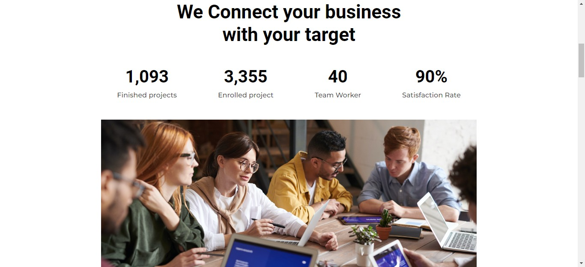
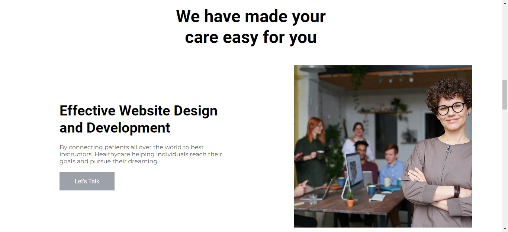
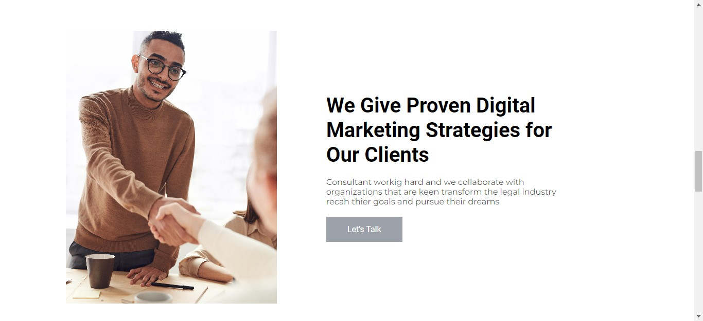
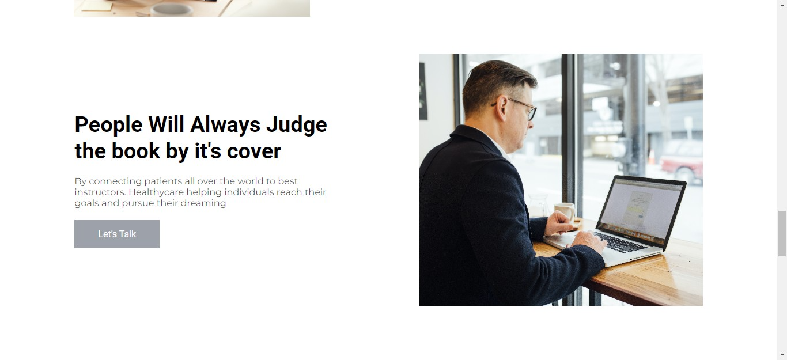
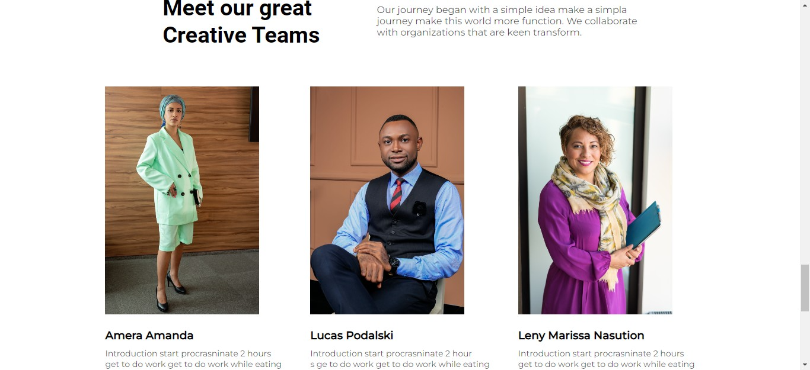
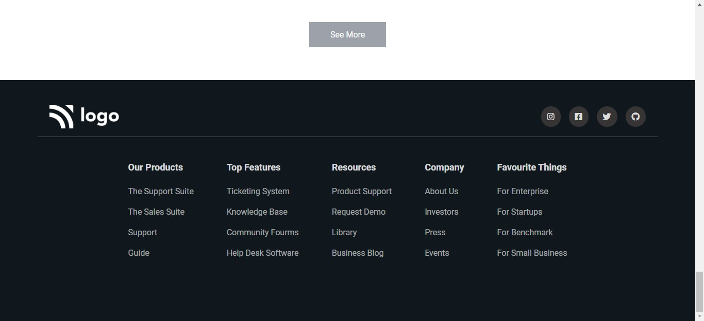

## Business Landing Page

### Things I learnt while doing this:
- Dealing with images according to requirements.
- Using flexbox - not just to divide thing but also to center a div.
- Building complex footer.

### Time Spent : 8 hours

### [Live Link](https://01-12-business-landing-page.netlify.app/)

### QuickLook:

